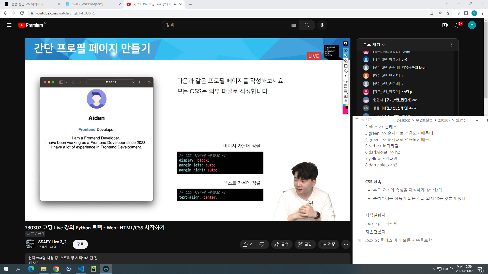

##### 웹

**웹사이트** : 웹 브라우저를 통해서 접속하는 웹페이지들의 모음

=> 링크를 통해 여러 웹페이지를 연결한 것

**HTML CSS JavaScript**

HTML - 구조

HTML + CSS - 표현(스타일링)

HTML + CSS + JS - 동작(인터렉션)

##### HTML(Hyper Text Markup Language)

: 웹 페이지를 작성(구조화) 하기 위한 언어

*Hyper Text* : 참조(하이퍼링크)를 통해 사용자가 한 문서에서 다른 문서로 즉시 접근할 수 있는 텍스트

*Markup language* : 태그 등을 이용하여 문서나 데이터의 구조를 명시하는 언어

MDN,,, W3schools....

**HTML 기본 구조**

- html : 문서의 최상위 요소

- head : 문서 메타데이터 요소
  
  - 문서 제목, 인코딩, 스타일, 외부 파일 로딩 등
  
  - 일반적으로 브라우저에 나타나지 않는 내용
  
  - 예 )
    
    \<title> \<link> \<style>등등

- body : 문서 본문 요소

##### 요소

\<h1>contents\</h1>

여는태그          닫는태그

html의 요소는 태그와 내용으로 구성되어 있다

- 태그는 컨텐츠(내용)를 감싸는 것으로 그 정보의 성격과 의미를 정의

- 내용이 없는 태그들
  
  br(줄바꿈), hr(수평선), img, input, link, meta

- 요소는 중첩될 수 있음
  
  - 요소의 중첩을 통해 하나의 문서를 구조화
  
  - 여는 태그와 닫는 태그의 쌍을 잘 확인해야함
    
    - 오류를 반환하는 것이 아닌 그냥 레이아웃이 깨진 상태로 출력되기 때문에 디버깅이 힘들어질수있음

##### 속성

\

    속성명             속성값

각 태그별로 사용할 수 있는 속성이 다르다

속성은 속성명과 속성값으로 이루어져 있다

=기준으로 공백 없이, 쌍따옴표 사용, 여는 태그 안쪽에 작성

- 속성을 통해 태그의 부가적인 정보를 설정할 수 있음

- 요소는 속성을 가질 수 있으며 경로나 크기와 같은 추가적인 정보 제공

- 요소의 시작 태그에 작성하며 보통 이름과 값이 하나의 쌍으로 존재

- 태그와 상관없이 사용 가능한 속성들도 있음
  
  - HTML Global Attribute
    
    모든 HTML요소가 공통으로 사용할 수 있는 대표적인 속성
    
    (몇몇 요소에는 아무 효과가 없을 수 있음)
    
    - id : 문서 전체에서 유일한 고유 식별자 지정
    
    - class
    
    - style

html에서 주석사용하는법

<!-- 어쩌고저쩌고 -->

**HTML 문서 구조화**

- 인라인/블록 요소

- 텍스트 요소
  
   : href속성 활용 다른 URL로 연결하는 하이퍼링크 생성
  
  <b></b>
  
  등등등

- 그룹 컨텐츠
  
  

  
  

  
  

  
  등등등

- form
  
  사용자의 정보(데이터)를 제출하기 위한 영역
  
  - 기본 속성 : action, method......(나중에)

- input
  
  form 안쪽에.. 다양한 타입을 가지는 입력 데이터 유형과 위젯이 제공됨
  
  - 대표적인 속성 : name, value, required, readonly....(나중에)

- input label
  
  - label 을 클릭하여 input 자체의 초점을 맞추거나 활성화 시킬 수 있음
    
    - 사용자는 선택할 수 있는 영역이 늘어나 웹/모바일 환경에서 편하게 사용할 수 있음
  
  - input에 id 속성을... label 에는 for 속성을 활용하여 상호 연관을 시킴

- input 유형 - 일반
  
  - 일반적으로 입력을 받기 위하여 제공되며 type으로 기본 검증 혹은 추가 속성을 활용할 수 있음
    
    - text :일반 텍스트 입력
    
    - password : 입력 시 값이 보이지 않고 문자를 특수기호로 표현
    
    - email : 이메일 형식 아닌 경우 form 제출 불가
    
    - number
    
    - file

- input 유형 - 항목 중 선택
  
  - label로 선택에 대한 내용을 작성하고 항목으로 선택할 수 있는 input을 제공
  
  - 동일한 범주에 속하는 항목들은 name을 통일하고 선택된 항목의 값은 value로 지정함
    
    - checkbox : 다중 선택
    
    - radio : 단일 선택

- input 유형 - 종합
  
  inpu요소의 동작은 type에 따라 달라지므로 각각내용숙지......

##### CSS(Cascading Style Sheets)

: 스타일을 지정하기 위한 언어

h1{                      선택자

  color:blue;        선언

  font-size: 15px;

}      속성       값

- 선택자를 통해 스타일을 지정할 요소를 선택

- 중괄호 안에는 속성과 값

**CSS 정의 방법**

- 인라인
  
  해당 태그에 직접 style 속성을 활용

- 내부 참조
  
  <head> 태그 내에 <style>에 지정

- 외부 참조
  
  외부 CSS 파일을 <head>내 <link>를 통해 불러오기
  
  <link rel='stylesheet' href='경로'>

**선택자(Selector) 유형**

- 기본 선택자
  
  - 전체 선택자(*), 요소(tag) 선택자
  
  - 클래스(class) 선택자(.class_name), 아이디(id) 선택자(# id_name), 속성(attr) 선택자

- 결합자
  
  - 자손 결합자, 자식 결합자

**CSS 적용 우선순위**

우선순위를 아래와 같이 그룹을 지어볼 수 있다

1. 중요도- 사용시 주의
   
   !important  -> 가장 먼저 적용, 무조건 1순위

2. 우선 순위
   
   인라인 > id > class, 속성 > 요소

퀴즈

1 orange >> p
2 blue  >> 클래스
3 green  >> 순서대로 적용되기때문에
4 green  >> 순서대로 적용되기때문..
5 red  >> id따라감
6 darkviolet  >> h2
7 yellow > 인라인
8 dartviolet >>h2

**CSS 상속**

- 부모 요소의 속성을 자식에게 상속한다

- 속성중에는 상속이 되는 것과 되지 않는 것들이 있다

자식결합자

.box > p   : 자식만

자손결합자

.box p : 클래스 아래 모든 자손들포함

